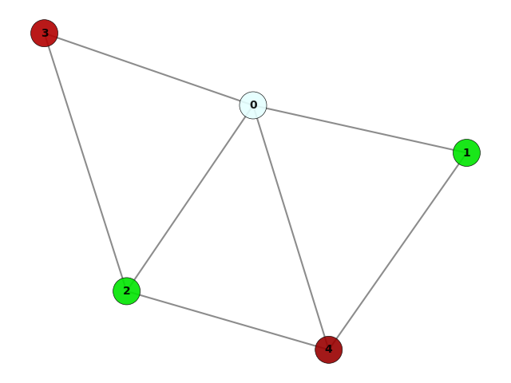

# Graph Coloring Algorithm

This program is a Python implementation of a graph coloring algorithm. Given an undirected graph, it colors the nodes of the graph such that no two adjacent nodes have the same color. The program uses the `networkx` and `matplotlib` libraries for visualizing the graph and its coloring.

## Installation

To run this program, you need to have Python 3 installed on your system. You also need to install the following libraries:

- `colour`
- `networkx`
- `matplotlib`

You can install these libraries using the following command:
```sh
pip install colour networkx matplotlib
```

## Usage

1. Clone the repository to your local machine.
2. Open a terminal window and navigate to the directory where you cloned the repository.
3. Run the following command to execute the program:
```sh
python graph_coloring.py
```
4. Enter the number of nodes in the graph when prompted.
5. For each node, enter the number of adjacent nodes and their indices.
6. The program will color the nodes of the graph and display the result in a window.

## Example

Suppose we want to color the following graph:

```lua
    0---1
   /|\  |
  / | \ |
 3--2--4
```

We run the program and enter `5` as the number of nodes. Then, for each node, we enter the indices of its adjacent nodes as follows:

```sh
Enter the number of adjacent nodes to node 0
4
Enter the adjacent node to node 0 between 0 and 4
1
Enter the adjacent node to node 0 between 0 and 4
3
Enter the adjacent node to node 0 between 0 and 4
2
Enter the adjacent node to node 0 between 0 and 4
4
Enter the number of adjacent nodes to node 1
2
Enter the adjacent node to node 1 between 0 and 4
0
Enter the adjacent node to node 1 between 0 and 4
4
Enter the number of adjacent nodes to node 2
3
Enter the adjacent node to node 2 between 0 and 4
0
Enter the adjacent node to node 2 between 0 and 4
3
Enter the adjacent node to node 2 between 0 and 4
4
Enter the number of adjacent nodes to node 3
2
Enter the adjacent node to node 3 between 0 and 4
0
Enter the adjacent node to node 3 between 0 and 4
2
Enter the number of adjacent nodes to node 4
3
Enter the adjacent node to node 4 between 0 and 4
0
Enter the adjacent node to node 4 between 0 and 4
1
Enter the adjacent node to node 4 between 0 and 4
2
```

The program will color the nodes of the graph and display the result in a window. The resulting graph will be displayed in a new window:
<div style="text-align:center;">
  
</div>
